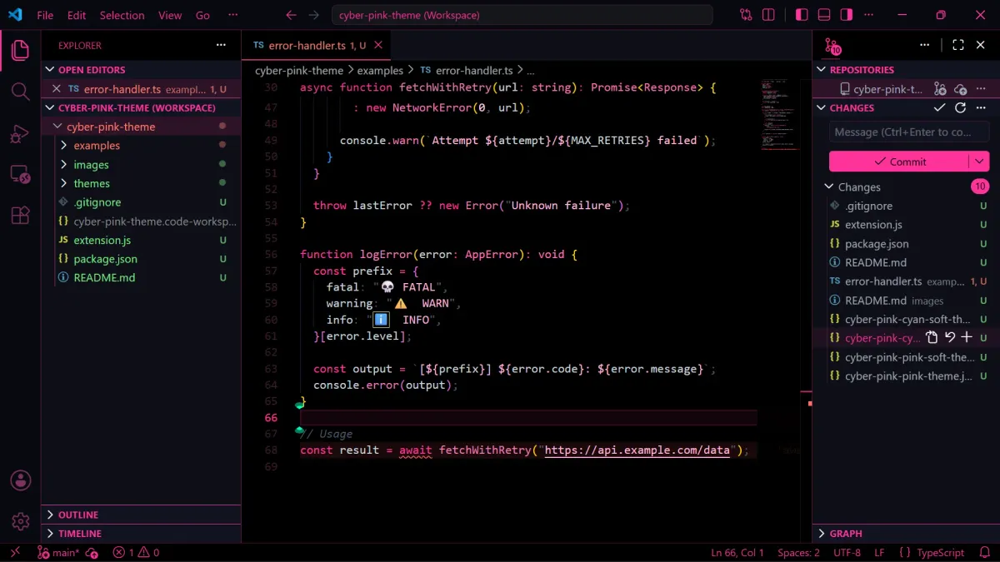
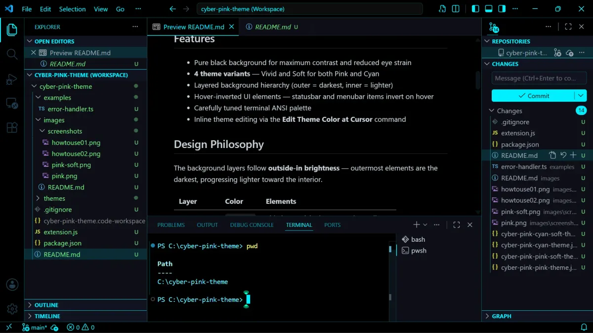

# Cyber Pink Theme

  [](./LICENSE) [](https://github.com/cyber-pinks/cyber-pink-theme/releases) [](https://github.com/cyber-pinks/cyber-pink-theme/commits)
  
A vibrant VS Code color theme inspired by futuristic cyberpunk.

## License & Credits

* **Publisher:** [CYBER-PINKS](https://github.com/CYBER-PINKS/)
* **Author:** [1abcdefggs (takaer)](https://github.com/1abcdefggs)
* **License:** [MIT](https://opensource.org/licenses/MIT) © 2026 1abcdefggs

## Design philosophy and features

For users who always use dark mode😎.
A vibrant VS Code color theme inspired by cyberpunk, available in two primary colors: Neon Pink & Cyan.
However, it is not suitable for people who easily experience eye strain from high contrast.

### Variations

💡How to build a futuristic world:Darken the room.

| **💗Pink Neon** | **💙Cyan Noen** |
| :---: | :---: |
| Default color | By the way, the color I'm using is cyan😊 |
|  |  |

## Layout & Contrast UI

A pure black background maximizes contrast and emphasizes neon elements.

| Variation | Window border, IDE frame |
| :--- | :--- |
| Choice of response: Choose from 4 options. | Neon border: The window borders glow like distinct neon accents. |
|  |  |
| If the colors are too vibrant, select "Soft". | Background structure (outside is darkest, inside is lightest, slightly) |

### Background Hierarchy (Outside-In Brightness)

The background layer follows a structural shading pattern. The outermost elements are the darkest, gradually becoming lighter towards the inner workspace.

| Layer        | Color      | Elements                                         | Brightness |
| -------------- | ------------ | -------------------------------------------------- | ------------ |
| **Outermost** | `#000000` | Title bar, activity bar, status bar, editor      | Darkest    |
| **Middle**    | `#0d0e17` | Sidebar, panel, tab bar                          | Medium     |
| **Inner**     | `#111320` | Section headers, inputs, menus, widgets          | Lightest   |

### Other Key Features

 -Hover-Inverted UI: Status bar and menu bar items dynamically invert colors on mouse hover.

 -Tuned Terminal: Carefully adjusted Terminal ANSI palette for maximum legibility.

 -Interactive Tweaks: Inline theme editing via custom command.

---

## Installation

If you download the repository from GitHub using the "Download ZIP" function,
the default filename will be `cyber-pink-theme-main.zip` (which will create a folder named `cyber-pink-theme-main` after extraction).If you save it as an extension, you can open it from VS Code.

However, if you package (build) the repository by running the `npx @vscode/vsce package` command following the "Packaged Install" instructions in the README, the file extension will be `.vsix`, and the filename will typically look like this:

### Local Install

1. Copy or clone this folder into your VS Code extensions directory:
   -**Windows**: `%USERPROFILE%\.vscode\extensions\`
   -**macOS/Linux**: `~/.vscode/extensions/`
2. Restart VS Code.
3. Open the Command Palette (`Ctrl+Shift+P` / `Cmd+Shift+P`) and run:

   Preferences: Color Theme

4. Select one of the **CYBER PINK** variants.

### Packaged Install (`.vsix`)

Steps to create an installer file from source code and install it.

1. Package the extension with [vsce](https://github.com/microsoft/vscode-vsce):

   ```bash
   npx @vscode/vsce package
   ```

2. Install the generated `.vsix` from the Extensions view (`...` → **Install from VSIX...**).

## Commands

| Command | Title | Description |
| --------- | ------- | ------------- |
| `cyberPink.editThemeColorAtCursor` | **Edit Theme Color at Cursor** | Detects the token type at the cursor and lets you edit its theme color directly. |
| `cyberPink.switchAccentPreset` | **Switch Accent Preset** | Quick-switch between accent color presets. |

Right-click in any editor and choose **Edit Theme Color at Cursor** to tweak token colors on the fly.

## Color Reference

### Accent Colors

| Variant | Primary | Light | Hover | Inactive |
| --------- | --------- | ------- | ------- | ---------- |
| **Pink Neon** | `#FF3399` | `#FF69B4` | `#CC297A` | `#7d3060` |
| **Pink Soft** | `#D92B82` | `#D95999` | `#AD2368` | `#6A2952` |
| **Cyan Neon** | `#00f0ff` | `#67e8f9` | `#00c3cc` | `#1e3a4d` |
| **Cyan soft** | `#00CCD9` | `#58C5D4` | `#00A6AD` | `#1A3242` |

### Semantic Colors

| Role | Color | Usage |
|------|-------|-------|
| **Success** | `#7ee787` | Git added, debug restart |
| **Warning** | `#f1fa8c` | Warnings, overview ruler |
| **Danger** | `#ff6b6b` | Errors, deletions, debug stop |
| **Text** | `#c8d1da` | Primary foreground |
| **Muted** | `#4a5568` | Disabled, placeholder |

---

## Changelog

### 0.3.0

-Theme Naming Update & README Improvements
-Updated theme variant names (Pink Neon / Pink Soft / Cyan Neon / Cyan Soft)
-Improved README layout and background hierarchy table
-Cleaned up old screenshot assets
-Added Automated features such as image resizing
-Other examples include color codes, etc.

### 0.2.1

-Fixed theme colors (updated active window border color to cyber cyan)

### 0.2.0

-Added 4 theme variants: Pink, Pink Soft, Cyan, Cyan Soft
-Redesigned background hierarchy (outside-in brightness)
-Added hover-inverted UI for statusbar and menubar
-Added accent-colored borders for activity bar, title bar, status bar
-Improved list hover, input field, and terminal styling

### 0.1.0

-Initial release with dark cyberpunk color scheme
-Added Edit Theme Color at Cursor command

## Repository & Issues

 Repository: [https://github.com/cyber-pinks/cyber-pink-theme](https://github.com/cyber-pinks/cyber-pink-theme)  

 Report issues or request features via [Issues](https://github.com/cyber-pinks/cyber-pink-theme/issues) on GitHub.

## License Copyright

This project is Licensed under the MIT License [MIT LICENSE](./LICENSE).

Copyright (c) 2026 [1abcdefggs](https://github.com/1abcdefggs)
