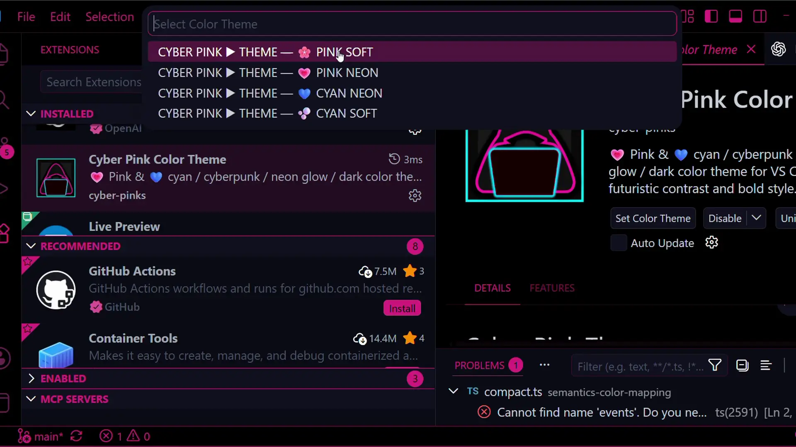
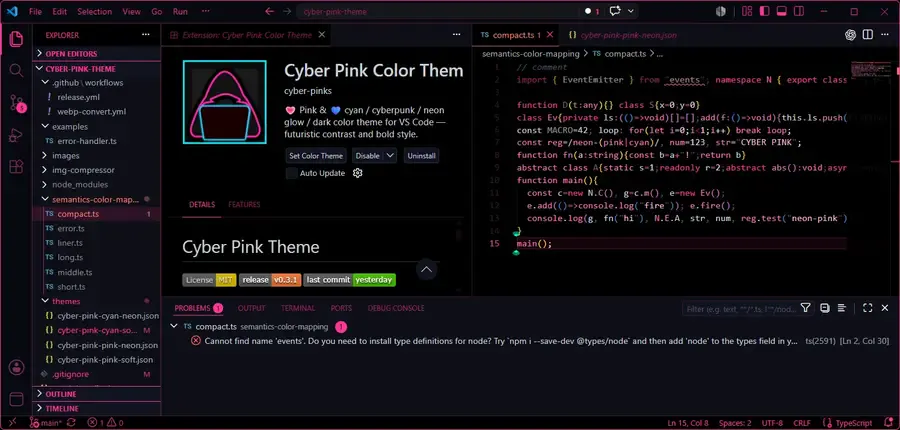
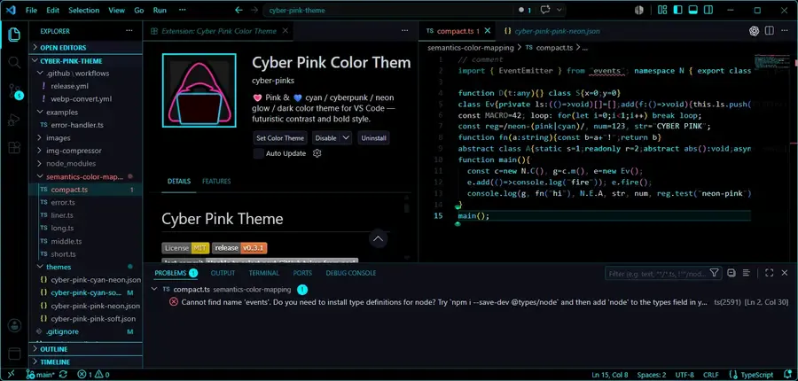
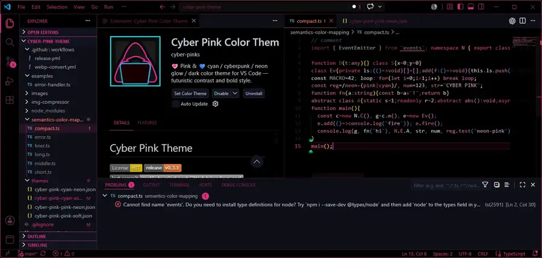
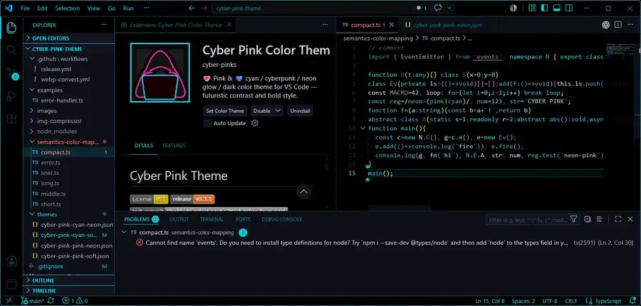
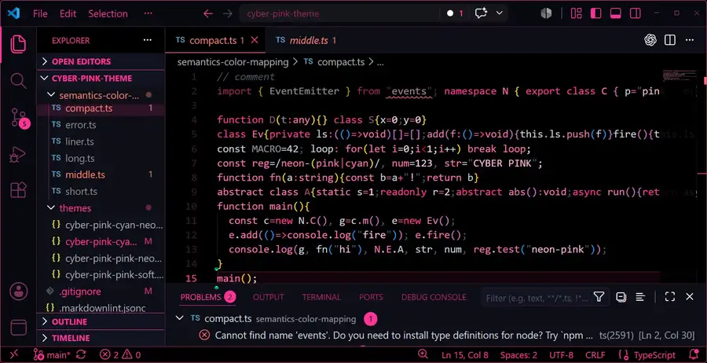
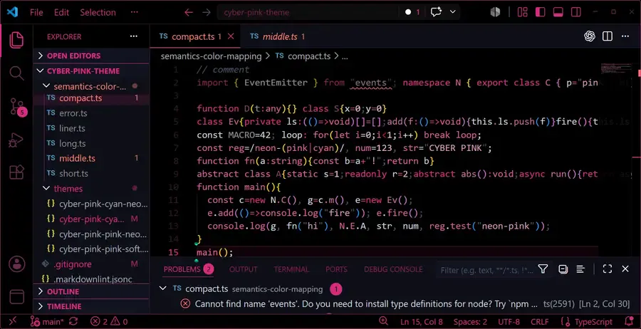
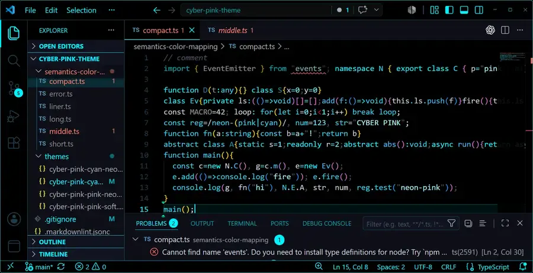
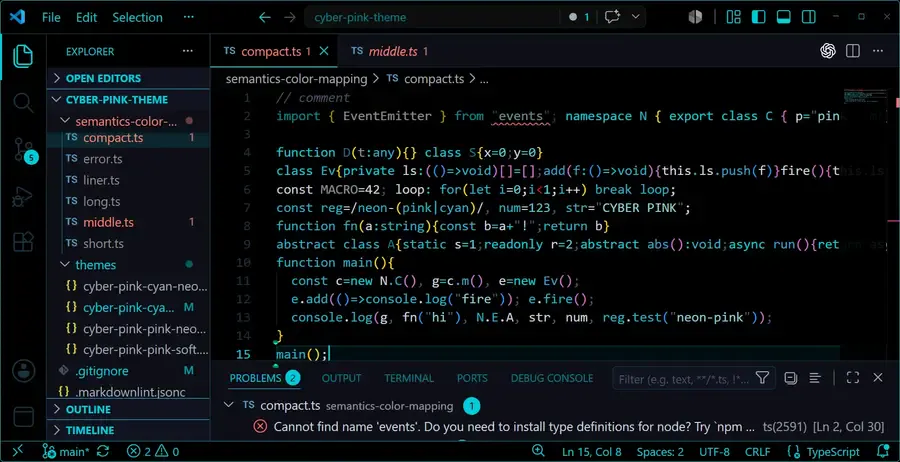

# 💗 Cyber Pink Theme

## CREDIT & LICENSE

[](https://github.com/cyber-pinks/cyber-pink-theme)
[](https://github.com/cyber-pinks/cyber-pink-theme/releases)
[](https://github.com/cyber-pinks/cyber-pink-theme)

[](https://marketplace.visualstudio.com/publishers/cyber-pinks)
[](https://github.com/CYBER-PINKS)
[](https://github.com/1abcdefggs)

## 📸 Preview

If you like this style, please give it a try😻



 I might have overlooked some bugs or color settings, so please let me know if you notice anything😻

## 📥 Installation

> **Supported IDEs**: VS Code, VSCodium, Cursor, **Windsurf (Devin Desktop)**, Gitpod, and **Antigravity IDE**.  
> *(Verified on Devin Desktop v3.3.18 and Antigravity IDE v2.1.1. Note: Standard web-based Antigravity and VS Code's Agent Mode are not supported)*

Choose your editor below to install the theme:

### 🔷 For Official VS Code
[](https://marketplace.visualstudio.com/items?itemName=cyber-pinks.cyber-pink-theme)

You can install the theme directly from the **VS Code Marketplace**:
- Open the Extensions view (`Ctrl+Shift+X` or `Cmd+Shift+X`)
- Search for `Cyber Pink Theme`
- Or install via web: **[VS Code Marketplace ↗](https://marketplace.visualstudio.com/items?itemName=cyber-pinks.cyber-pink-theme)**

### 🚀 For Cursor, VSCodium, Windsurf (Devin Desktop), Gitpod, etc.
[)](https://open-vsx.org/extension/cyber-pinks/cyber-pink-theme)

These editors use the **Open VSX Registry**. The theme is fully compatible!
- Open your editor's Extensions view
- Search for `Cyber Pink Theme`
- Or install via web: **[Open VSX Registry ↗](https://open-vsx.org/extension/cyber-pinks/cyber-pink-theme)**


## NAVIGATION

<div style="display:flex; flex-wrap:wrap; gap:1rem;">
<!-- ===== THEME CATEGORY ===== -->
<div style="
  flex:2; min-width:300px;
  border:1px solid #FF339999;
  border-radius:5px;
  padding:1rem;
  background:#0a0a0fcc;
">
<h3 style="color:#FF66CC; margin:0 0 0 0; font-size:1.05rem;">🎨 Theme & Design</h3>
  💗 <a href="#features" style="color:#FF66CC;">Features</a>
  🎨 <a href="#design-philosophy-and-features" style="color:#FF99CC;">Design Philosophy</a>
  🌈 <a href="#variations" style="color:#FF66CC;">Variations</a>
  🖥 <a href="#theme-details" style="color:#FF99CC;">Theme Details</a>
</div>
<!-- ===== COLOR CATEGORY ===== -->
<div style="
  flex:2; min-width:300px;
  border:1px solid #00Eaff99;
  border-radius:5px;
  padding:1rem;
  background:#071018cc;
">
  <h3 style="color:#00Eaff; margin:0 0 0 0; font-size:1.05rem;">🎨 Color System</h3>
  🎯 <a href="#accent-colors" style="color:#00Eaff;">Accent Colors</a>
  🔧 <a href="#semantic-colors" style="color:#67e8f9;">Semantic Colors</a>
  🌕 <a href="#background-layerdark-outerlight-inner" style="color:#00c3cc;">Background Layer</a>
</div>
<!-- ===== INSTALLATION CATEGORY ===== -->
<div style="
  flex:3; min-width:300px;
  border:1px solid #00Eaff99;
  border-radius:5px;
  padding:1rem;
  background:#071018cc;
">
  <h3 style="color:#00Eaff; margin:0 0 0 0; font-size:1.05rem;">📦 Installation</h3>
  📦 <a href="#installation" style="color:#67e8f9;">Installation</a>
  🛠 <a href="#for-development--for-github-repository-installations-" style="color:#00Eaff;">Development</a>
  ⚙️ <a href="#commands" style="color:#67e8f9;">Commands</a>
  📝 <a href="#change-log" style="color:#00Eaff;">Change Log</a>
</div>
</div>

## ✨ DESIGN PHILOSOPHY & FEATURES

**Futuristic Cyberpunk Glow** A vibrant VS Code theme built on striking pink and cyan. Designed for the ultimate dark mode experience 😎.  
*(Note: Features high-contrast neon colors, which may not be suitable for users prone to eye strain.)*

- 🔥 **Neon Glow Aesthetics** A pure cyberpunk color scheme that makes your code pop.
- 💗 **4 Theme Variants** Choose your vibe: Pink Neon / Pink Soft / Cyan Neon / Cyan Soft.
- 🌌 **Outside-In Brightness** A smart, layered UI. Darker outer frames draw focus to slightly brighter inner workspaces for maximum visibility.


## VARIATIONS
💡 How to create your futuristic space: Darken the room🌃.

GitHub Poll: Pink or Cyan? **[Vote on GitHub](https://github.com/orgs/cyber-pinks/discussions/3)** 😻

<table>
<tr>
  <th style="text-align:center; color:#FF3399;">💗 Pink Color</th>
  <th style="text-align:center; color:#00Eaff;">💙 Cyan Color</th>
</tr>
<tr>
  <td style="text-align:center; font-weight:bold; color:#FF3399;">
    NEON / #FF3399
  </td>
  <td style="text-align:center; font-weight:bold; color:#00F0FF;">
    NEON / #00F0FF
  </td>
</tr>
<tr>
  <td style="text-align:center;">
    
  </td>
  <td style="text-align:center;">
    
  </td>
</tr>
<tr>
  <td style="text-align:center; font-weight:bold; color:#D92B82;">
    SOFT / #D92B82
  </td>
  <td style="text-align:center; font-weight:bold; color:#00CCD9;">
    SOFT / #00CCD9
  </td>
</tr>

<tr>
  <td style="text-align:center;">
    
  </td>
  <td style="text-align:center;">
    
  </td>
</tr>
</table>

*Neon themes provide high-contrast, energetic lighting for a true cyber-punk feel,  
while Soft themes offer a more subtle, comfortable palette for long hours of coding.*

---

<div style="display:flex; flex-wrap:wrap; gap:0.2rem; margin:1rem 0;">

<!-- ACCENT COLORS -->
<div style="flex:1; min-width:320px;">
<h2>🎨 ACCENT COLORS</h2>

<table>
<tr><th>Variant</th><th>Primary</th><th>Light</th><th>Hover</th><th>Inactive</th></tr>

<tr>
<td><b>Pink Neon</b></td>
<td> #FF3399</td>
<td> #FF69B4</td>
<td> #CC297A</td>
<td> #7d3060</td>
</tr>

<tr>
<td><b>Pink Soft</b></td>
<td> #D92B82</td>
<td> #D95999</td>
<td> #AD2368</td>
<td> #6A2952</td>
</tr>

<tr>
<td><b>Cyan Neon</b></td>
<td> #00F0FF</td>
<td> #67E8F9</td>
<td> #00C3CC</td>
<td> #1E3A4D</td>
</tr>

<tr>
<td><b>Cyan Soft</b></td>
<td> #00CCD9</td>
<td> #58C5D4</td>
<td> #00A6AD</td>
<td> #1A3242</td>
</tr>
</table>
</div>

<!-- SEMANTIC COLORS -->
<div style="flex:1; min-width:320px;">
<h2>🎯 SEMANTIC COLORS</h2>

<table>
<tr><th>Role</th><th>Color</th><th>Usage</th></tr>

<tr>
<td><b>Success</b></td>
<td> #7ee787</td>
<td>Git added, debug restart</td>
</tr>

<tr>
<td><b>Warning</b></td>
<td> #f1fa8c</td>
<td>Warnings, overview ruler</td>
</tr>

<tr>
<td><b>Danger</b></td>
<td> #ff6b6b</td>
<td>Errors, deletions, debug stop</td>
</tr>

<tr>
<td><b>Text</b></td>
<td> #c8d1da</td>
<td>Primary foreground</td>
</tr>

<tr>
<td><b>Muted</b></td>
<td> #4a5568</td>
<td>Disabled, placeholder</td>
</tr>

</table>
</div>
</div>

---

<div style="flex:1; min-width:320px;">
<h2>🖤 BACKGROUND LAYER</h2>

<table>
<tr><th>Layer</th><th>Color</th><th>Usage</th></tr>

<tr>
<td><b>Outermost</b></td>
<td> <code>#000000</code></td>
<td>Title bar, Activity bar, Status bar, Editor,Primary outer frame</td>
</tr>

<tr>
<td><b>Middle</b></td>
<td> <code>#0d0e17</code></td>
<td>Sidebar, Panel, Tab bar,Main workspace containers</td>
</tr>

<tr>
<td><b>Inner</b></td>
<td> <code>#111320</code></td>
<td>Section headers, Inputs, Menus, Widgets Inner interactive surfaces</td>
</tr>

</table>
</div>


### THEME DETAILS

An example of how it appears in actual code.  
Basically, it's mostly the color of the ACCENT.  
All the examples are written in the Code section.

[](images/screenshots/pink-neon-theme-p2.webp)

---

### For details on all ColorThemes
Clicking on the PINK, neon, or cyan images will display them in a larger size.

[](images/screenshots/pink-soft-theme-p2.webp)
[](images/screenshots/cyan-neon-theme-p2.webp)
[](images/screenshots/cyan-soft-theme-p2.webp)

💡 How to create your futuristic space: Programming Music 🎶

---

All semantic and accent color mappings used in this theme are available here:


### Semantic Token Colors  in the editor area

- An example of how it appears in actual code. Basically, it's mostly the color of the ACCENT.

- All the examples are written in the Code section.

- For verification purposes, Some code snippets are very widely spaced, while others are written on just a single line.
compact,liner,long,middle,short,error-handler,error, are all type scripts.


```ts
// Liner.ts
import {EventEmitter} from"events";namespace N{export class C{p="pink";m(){return this.p.toUpperCase()}}export interface I{a:number;b:number}export type T={ok:boolean};export function U<K>(v:K){return v}export enum E{A="a",B="b"}}function D(t:any){}class S{x=0;y=0}class Ev{private ls:(()=>void)[]=[];add(f:()=>void){this.ls.push(f)}fire(){this.ls.forEach(f=>f())}}const MACRO=42;loop:for(let i=0;i<1;i++)break loop;const reg=/neon-(pink|cyan)/,num=123,str="CYBER PINK";function fn(a:string){const b=a+"!";return b}abstract class A{static s=1;readonly r=2;abstract abs():void;async run(){return"async"}/**@deprecated*/old(){return"x"}}(function(){const c=new N.C(),g=c.m(),e=new Ev();e.add(()=>console.log("fire"));e.fire();console.log(g,fn("hi"),N.E.A,str,num,reg.test("neon-pink"))})();
```

```ts
// compact.ts
import { EventEmitter } from "events"; namespace N { export class C { p="pink"; m(){return this.p.toUpperCase()} } export interface I{a:number;b:number} export type T={ok:boolean}; export function U<K>(v:K){return v} export enum E{A="a",B="b"} }

function D(t:any){} class S{x=0;y=0}
class Ev{private ls:(()=>void)[]=[];add(f:()=>void){this.ls.push(f)}fire(){this.ls.forEach(f=>f())}}
const MACRO=42; loop: for(let i=0;i<1;i++) break loop;
const reg=/neon-(pink|cyan)/, num=123, str="CYBER PINK";
function fn(a:string){const b=a+"!";return b}
abstract class A{static s=1;readonly r=2;abstract abs():void;async run(){return"async"} /**@deprecated*/ old(){return"x"}}
function main(){
  const c=new N.C(), g=c.m(), e=new Ev();
  e.add(()=>console.log("fire")); e.fire();
  console.log(g, fn("hi"), N.E.A, str, num, reg.test("neon-pink"));
}
main();
```

Markdown previews are rendered as HTML, so colors are not reflected. To see the difference, please visit the extension's details page or paste the code into the editor.

👉 **Semantic Color Mapping code page, Github Repository**  

https://github.com/cyber-pinks/cyber-pink-theme/tree/main/semantics-color-mapping

All semantic and accent color mappings used in this theme are available here:

---

## Other Key Features
 - Hover-Inverted UI: Status bar and menu bar items dynamically invert colors on mouse hover.
 - Tuned Terminal: Carefully adjusted Terminal ANSI palette for maximum legibility.
 - Interactive Tweaks: Inline theme editing via custom command.

---

## 🖥️ INSTALLATION 

### Install and use it as a theme.

The theme color selection will probably appear automatically after installation. You can also change it later using either of the following methods:

| Method 1: EXTENSIONS LIST | Method 2: VS Code MENU FILE | Method 3: COMMAND PALETTE |
| :--- | :--- | :--- |
| - **EXTENSIONS:** RIGHT-CLICK > Set color theme<br>- **DETAILS PAGE:** [Set color theme] BUTTON | - **Preferences** > Theme > Color Theme | - **MENU:** View > Command Palette<br>- **Shortcut:** Ctrl+Shift+P / Cmd+Shift+P<br>- **Run:** `Preferences: Color Theme`<br>- Select a "CYBER PINK" variant |


If you're on GitHub: The easiest way to use the theme color is to type "cyber pink" into the search bar in the extensions section of your IDE, such as VS Code, and install it.

Alternatively, you can install it from the Marketplace.

Clicking the install button from the Marketplace will open VS Code and allow you to install it.

[https://marketplace.visualstudio.com/items?itemName=cyber-pinks.cyber-pink-theme](https://marketplace.visualstudio.com/items?itemName=cyber-pinks.cyber-pink-theme)


---

## For DEVELOPMENT / For GitHub Repository Installations /

### GitHub repository

If you're installing from a GitHub repository instead of VS Code or the Marketplace...

1. Copy or clone this folder into your VS Code extensions directory:
Save it in the VS Code EXTENSIONS folder. The location is as follows

- **Windows**: `%USERPROFILE%/.vscode/extensions/`
- **macOS/Linux**: `~/.vscode/extensions/`

2. Restart VS Code.
3. Open the Command Palette (`Ctrl+Shift+P` / `Cmd+Shift+P`) and run:
   Preferences: Color Theme
4. Select one of the **CYBER PINK** variants.
---


### 📦️ Packaged Install (`.vsix`)

This section explains how to create an installer file from the source code and install it manually. The extension will be packaged into a `.vsix` file using `vsce`.

**Prerequisites: Check if npm is installed**
Before packaging, ensure you have [Node.js and npm](https://nodejs.org/) installed on your machine. You can verify this by running the following commands in your terminal:

```bash
node -v
npm -v

```

*(If version numbers are displayed, you are good to go! If not, please download and install Node.js from the official website first.)*

**1. Package the extension using [vsce](https://github.com/microsoft/vscode-vsce):**

```bash
npx @vscode/vsce package

```

**2. Install the generated `.vsix` file:** You can do this from the Extensions view (`...` → **Install from VSIX...**). Alternatively, you can right-click the file in the VS Code Explorer and select **Install Extension VSIX**.


### Commands

| Command | Title | Description |
| --------- | ------- | ------------- |
| `cyberPink.applyPinkNeon` | **💗 Pink Neon Set** | Apply the Pink Neon theme variant with a bright cyberpunk glow. |
| `cyberPink.applyPinkSoft` | **🌸 Pink Soft Set** | Apply the Pink Soft theme variant with muted glow for extended sessions. |
| `cyberPink.applyCyanNeon` | **💙 Cyan Neon Set** | Apply the Cyan Neon theme variant with a bright cyberpunk glow. |
| `cyberPink.applyCyanSoft` | **🫧 Cyan Soft Set** | Apply the Cyan Soft theme variant with muted glow for extended sessions. |
| `cyberPink.switchAccentPreset` | **Switch Accent Preset** | Quickly switch between available Cyber Pink accent color presets. |
| `cyberPink.editThemeColorAtCursor` | **Edit Theme Color at Cursor** | Edit the theme color hex value directly at the current cursor position. Detects the token type at the cursor and lets you edit its theme color directly. |

Right-click in any editor and choose **Edit Theme Color at Cursor** to tweak token colors on the fly.

---


## CHANGELOG

A problem recently discovered by the developer
I tried putting in a badge, but it's making my eyes hurt.😂

[  ](https://github.com/cyber-pinks/cyber-pink-theme/issues)[  ](https://github.com/cyber-pinks/cyber-pink-theme/issues?q=is%3Aissue+is%3Aclosed)

[  ](https://github.com/cyber-pinks/cyber-pink-theme/pulls)[  ](https://github.com/cyber-pinks/cyber-pink-theme/pulls?q=is%3Apr+is%3Aclosed)


 ### [0.4.3]
- **Documentation**: Enhanced README layout by moving previews to the top.
- **Support**: Explicitly added Open VSX Registry support and badges for VSCodium, Cursor, Windsurf (Devin Desktop), Gitpod, etc. Added verified IDE version notes, and noted that standard web-based Antigravity and VS Code's Agent Mode are not supported.
- **Design**: Updated badge styles to flat for a cleaner, more minimalist look.
- **Codebase**: Minor formatting adjustments in `extension.js`.

 ### [0.4.2]
- **Cleanup**: Removed unnecessary image files (themeselect2, theme2) from the project.
- **Maintenance**: Cleaned up and optimized internal files.


 ### 0.4.1 — Status Bar Compact Hover Fix

[](https://github.com/cyber-pinks/cyber-pink-theme/issues/1)
[](https://github.com/cyber-pinks/cyber-pink-theme/pull/2)
 

 Maintenance
- We reduced the repository size by removing unnecessary images (e.g., images/screenshots/).
= simplified the configuration by removing unnecessary CSS files, Markdownlint settings, and unused workflow files.
- updated .vscodeignore to optimize packaging.
- reorganized the code structure, including moving error handling sample code to semantic color mapping.

✨ Fixed

- Corrected statusBarItem.compactHoverForeground contrast issue
- Fixed an issue where text became invisible when hovering compact status bar items
- Ensured consistent behavior across all four theme variants
- Improved foreground/background visibility according to VS Code theme color specifications


### 0.4.0 — Theme Variants & Asset Improvements

✨ Added

- Added a variation comparison table to the README
- Added Marketplace assets including galleryBanner and updated extension icon
- Introduced .vscodeignore to optimize extension packaging

🔧 Improved

- Enhanced icon visibility in package.json
- Updated README multiple times for clarity, structure, and visuals
- Improved WebP auto-conversion workflow
- Added semantic color mapping test cases to improve theme quality

🗑 Removed / Cleaned

- Removed unused screenshot images (PNG/WebP)
- Updated and refined release.yml workflow multiple times


<details style="background: #cecece13; border:1px solid #ff33996a;        border-radius:5px; margin:1rem 0;padding:10px;">


<summary style=" cursor: pointer;">OPEN PREVIOUS CHANGES(CLICK)

---

### 0.3.2 — Performance & Quality Update

- Optimized assets: Converted all screenshots to WebP format for faster loading

</summary>

- Improved README: Clarified differences between Neon and Soft themes with comparison tables
- Enhanced developer experience: Added automated image compression scripts
- Added semantic color mapping test cases for reliable theme updates
- Updated .vscodeignore to ensure clean packaging
- General housekeeping and version bump
---
### 0.3.1 — Patch Fixes & Marketplace Compliance

- Fixed invalid image paths in README (Windows-style "\" → "/" conversion)
- Replaced remaining SVG references to comply with VS Code Marketplace restrictions
- Updated README image sources to valid PNG/WEBP formats
- Ensured GitHub Actions release workflow passes successfully
- Minor cleanup and consistency fixes following the 0.3.0 update

---
### 0.3.0

- Theme Naming Update & README Improvements
- Updated theme variant names (Pink Neon / Pink Soft / Cyan Neon / Cyan Soft)
- Improved README layout and background hierarchy table
- Cleaned up old screenshot assets
- Added Automated features such as image resizing
- Other examples include color codes, etc.

---
### 0.2.1

- Fixed theme colors (updated active window border color to cyber cyan)

---
### 0.2.0

- Added 4 theme variants: Pink, Pink Soft, Cyan, Cyan Soft
- Redesigned background hierarchy (outside-in brightness)
- Added hover-inverted UI for statusbar and menubar
- Added accent-colored borders for activity bar, title bar, status bar
- Improved list hover, input field, and terminal styling

---
### 0.1.0

- Initial release with dark cyberpunk color scheme
- Added Edit Theme Color at Cursor command

</details>


## REPOSITORY & ISSUES

[  ](https://github.com/cyber-pinks/cyber-pink-theme)[  ](https://github.com/cyber-pinks/cyber-pink-theme/releases)[  ](https://github.com/cyber-pinks/cyber-pink-theme/commits)[  ](https://github.com/cyber-pinks/cyber-pink-theme)


📁 Repository: [https://github.com/cyber-pinks/cyber-pink-theme](https://github.com/cyber-pinks/cyber-pink-theme)  

📩 Report issues or request features via [Issues](https://github.com/cyber-pinks/cyber-pink-theme/issues) on GitHub.

## LICENSE & COPYRIGHT

[](https://marketplace.visualstudio.com/publishers/cyber-pinks)
[](https://github.com/CYBER-PINKS)
[](https://github.com/1abcdefggs)


This project is Licensed under the MIT License [MIT LICENSE](./LICENSE).
Copyright (c) 2026 [1abcdefggs](https://github.com/1abcdefggs)